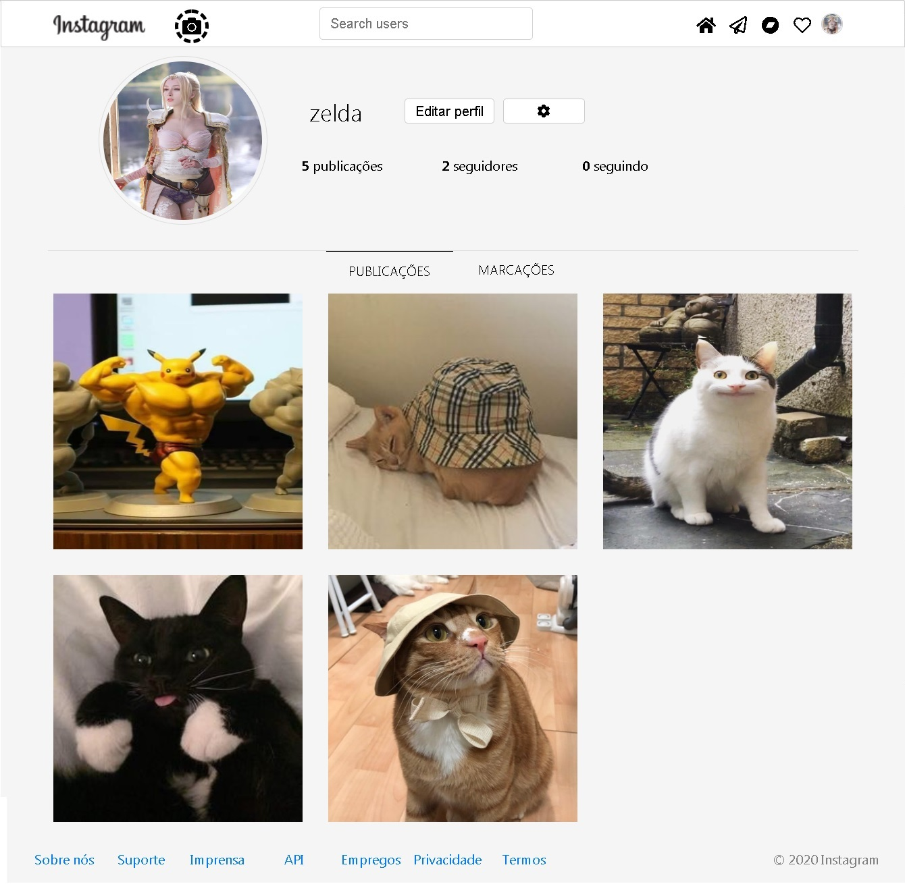
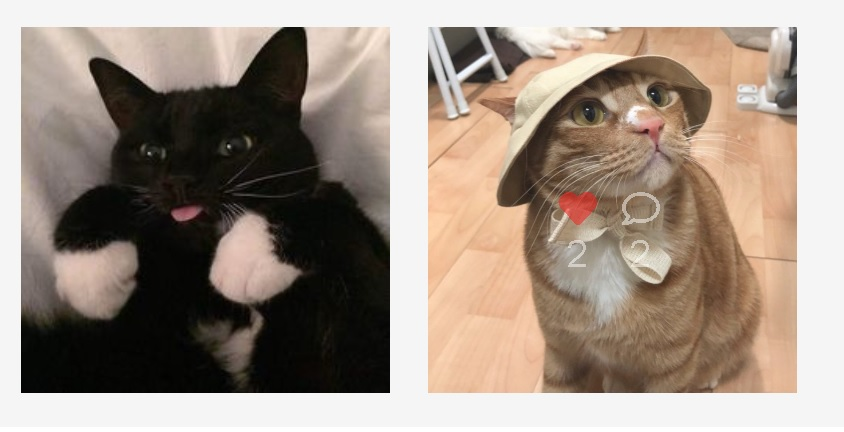
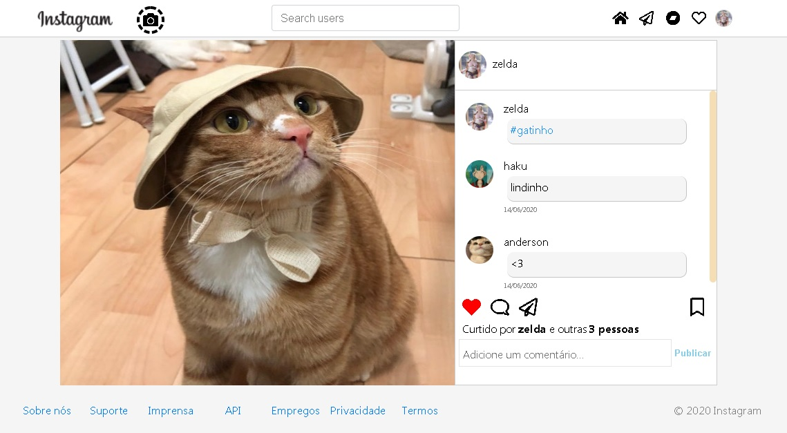
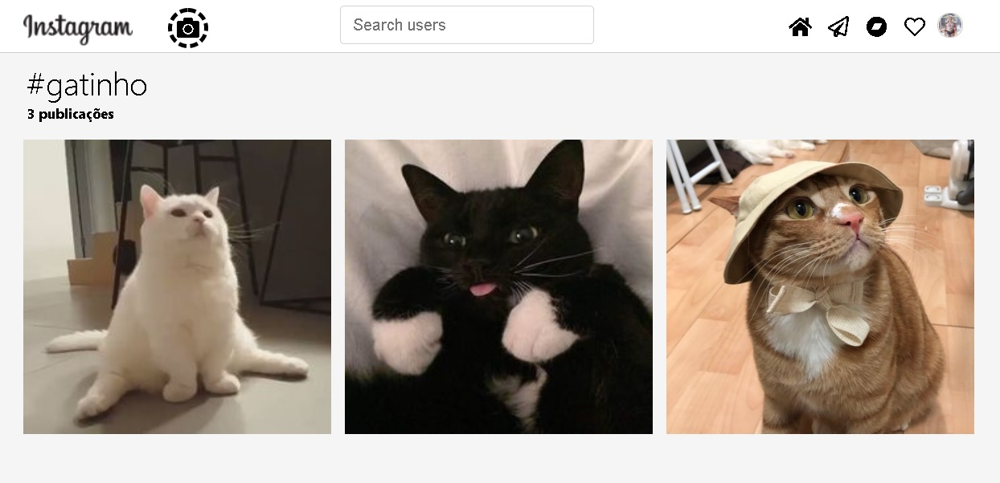

Projeto feito utilizando laravel e mysql com intuito de estudar e aprender mais a ferramenta

<b>Features</b>
<ul>
    <li>Postar foto</li>
    <ul>
        <li>Curtir foto</li>
        <li>Comentar</li>
        <li>Exibir todos os likes e comentarios</li>
        <li>Ao clicar no numero de curtidas exibe todos os usuarios que curtiram a foto</li>
        <li>Editar foto no perfil clicando em "editar perfil" - somente é possivel alterar a foto</li>
    </ul>
</ul>

<ul>
    <li>Usuarios</li>
    <ul>
        <li>Seguir usuarios</li>
        <li>Ao clicar em seguidores/seguindo exibe os usuarios que estão seguindo</li>
        <li>Na Timeline exibe as ultimas postagens dos usuarios que seguiu</li>
    </ul>
</ul>

<ul>
    <li>Buscas</li>
    <ul>
        <li>Digitando # com palavra desajada exibe todos os posts que contem essa #</li>
        <li>Digitando o nome do usuario exibe se ele existe ou não</li>
    </ul>
</ul>

  

<h4>Para rodar o projeto basta baixar os arquivos, na pasta raiz e no terminal digite <b>composer install.</b> 
    E depois <b>npm install</b> e em .env digite o nome da sua tabela da base de dados.<b> 
    No meu caso esta como instagram, depois no terminal "php artisan migrate"  
    E pronto tudo foi finalizado. Você pode criar contas, adicionar fotos e testar a vontade
    </h4>
    

  

